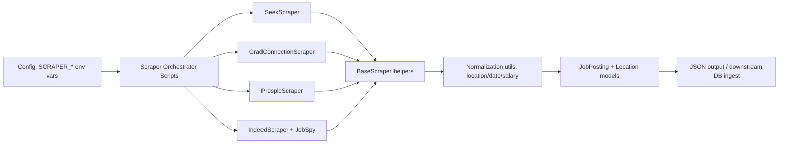

# Jobly - Australian Job Market Scraper

Automate collection of Australian graduate and early-career job postings into one normalized `JobPosting` schema for downstream analytics and matching.

## 1) Project Title and One-Sentence Value Proposition
**Project Title:** Jobly (AUJobsScraper)  
**Value Proposition:** A Python scraping toolkit that gathers jobs from Seek, GradConnection, Prosple, and Indeed and outputs consistent structured records.

## 2) Problem Statement
**What problem does this solve?**  
Australian job listings are fragmented across multiple platforms with different HTML structures and inconsistent field formats (title, location, salary, posting dates). This project standardizes extraction and normalization in one place.

**Who is it for?**
- Data engineers building job pipelines
- Developers creating job discovery apps
- Analysts tracking market trends
- Teams needing a consistent upstream job feed

**Why does it matter?**
- Reduces manual scraping/cleaning effort
- Improves data consistency for downstream systems
- Supports deduplication via generated fingerprints
- Enables faster iteration on job-market intelligence workflows

## 3) Architecture Overview
Jobly uses source-specific scraper adapters and maps each posting into a shared `JobPosting` model.



**Key components**
- `aujobsscraper/config.py`: Typed settings from `SCRAPER_*` environment variables.
- `aujobsscraper/scrapers/base_scraper.py`: Shared collection/validation/concurrency flow.
- `aujobsscraper/scrapers/*.py`: Platform-specific extraction logic.
- `aujobsscraper/utils/*.py`: HTML cleanup, location normalization, salary parsing.
- `aujobsscraper/models/*.py`: Canonical data models (`JobPosting`, `Location`, fingerprinting).
- `scripts/*.py`: Runnable orchestration scripts and local test runners.

## 4) Features
- Multi-source scraping: Seek, GradConnection, Prosple, Indeed
- Unified `JobPosting` schema across all platforms
- Configurable pagination, keywords, date windows, and concurrency
- Initial-run mode for broader historical fetch windows
- Cross-source URL skipping support (`skip_urls`)
- Salary normalization to annual min/max values
- Location normalization to Australian city/state structure
- Automatic fingerprint generation for deduplication
- JSON export support in runner scripts

## 5) Installation and Setup
### Prerequisites
- Python `3.12+`
- Playwright Chromium browser

### Setup
```bash
python -m venv .venv
.venv\Scripts\Activate.ps1
pip install -e .
playwright install
```

## 6) Environment Variables
All configuration is read from environment variables prefixed with `SCRAPER_`.

| Variable | Type | Default | Description |
|---|---|---:|---|
| `SCRAPER_SEARCH_KEYWORDS` | JSON list[str] | `["software engineer","software developer","data scientist","machine learning engineer","ai engineer","data engineer"]` | Search terms for Seek/Prosple/Indeed |
| `SCRAPER_GRADCONNECTION_KEYWORDS` | JSON list[str] | `["software engineer","software developer","data science","machine learning engineer","ai engineer","data analyst"]` | Search terms for GradConnection |
| `SCRAPER_MAX_PAGES` | int | `20` | Max pages per term during initial run (and Seek regular runs) |
| `SCRAPER_DAYS_FROM_POSTED` | int | `2` | Seek recency filter (regular mode) |
| `SCRAPER_INITIAL_DAYS_FROM_POSTED` | int | `31` | Seek recency filter when `SCRAPER_INITIAL_RUN=true` |
| `SCRAPER_INITIAL_RUN` | bool | `false` | Enables broader first-run behavior across scrapers |
| `SCRAPER_CONCURRENCY` | int | `5` | Per-scraper concurrent job detail page workers |
| `SCRAPER_INDEED_HOURS_OLD` | int | `72` | Indeed recency window (regular mode) |
| `SCRAPER_INDEED_INITIAL_HOURS_OLD` | int | `2000` | Indeed recency window when initial run is enabled |
| `SCRAPER_INDEED_RESULTS_WANTED` | int | `20` | Results fetched per Indeed search term |
| `SCRAPER_INDEED_RESULTS_WANTED_TOTAL` | int or null | `100` | Cap across all Indeed terms |
| `SCRAPER_INDEED_TERM_CONCURRENCY` | int | `2` | Concurrent Indeed term fetches |
| `SCRAPER_INDEED_LOCATION` | str | `""` | Indeed location filter |
| `SCRAPER_INDEED_COUNTRY` | str | `"Australia"` | Indeed country |
| `SCRAPER_PROSPLE_ITEMS_PER_PAGE` | int | `20` | Pagination step size for Prosple |
| `SCRAPER_PROSPLE_REGULAR_MAX_PAGES` | int | `4` | Prosple max pages in regular mode |
| `SCRAPER_GRADCONNECTION_REGULAR_MAX_PAGES` | int | `4` | GradConnection max pages in regular mode |

Example:
```bash
$env:SCRAPER_SEARCH_KEYWORDS='["software engineer","data scientist"]'
$env:SCRAPER_INITIAL_RUN='true'
$env:SCRAPER_INDEED_RESULTS_WANTED_TOTAL='120'
```

## 7) Usage
### Run all scrapers in first-iteration preview mode
```bash
python scripts/run_all_scrapers_first_iteration.py
python scripts/run_all_scrapers_first_iteration.py -o results/preview_jobs.json
python scripts/run_all_scrapers_first_iteration.py --scrapers seek,indeed
```

### Run the standard orchestrator script
```bash
python scripts/run_all_scrapers.py
python scripts/run_all_scrapers.py -o results/jobs.json
```

### Run individual scrapers
```bash
python -m aujobsscraper.scrapers.seek_scraper
python -m aujobsscraper.scrapers.gradconnection_scraper
python -m aujobsscraper.scrapers.prosple_scraper
python -m aujobsscraper.scrapers.indeed_scraper
```

## 8) Database Schema
This repository currently defines a canonical **data model schema** (Pydantic) rather than shipping database migrations. The intended persisted record shape is:

### `job_postings` (logical table)
| Column | Type | Nullable | Description |
|---|---|---|---|
| `fingerprint` | string | Yes (auto-generated if missing) | Deterministic dedupe key generated from company/title/location |
| `job_title` | string | No | Original job title from source |
| `company` | string | No | Employer/company name |
| `description` | text | No | Plain-text job description |
| `locations` | JSON array | No | Array of location objects (`city`, `state`) |
| `source_urls` | JSON array | No | Source links for the posting |
| `platforms` | JSON array | No | Platforms where posting was found |
| `salary` | JSON object | Yes | `{annual_min, annual_max}` |
| `posted_at` | date/string ISO | Yes | Posting date in ISO format |
| `closing_date` | date/string ISO | Yes | Closing date in ISO format |

<<<<<<< HEAD
### `locations` (embedded object)
| Field | Type | Nullable | Description |
|---|---|---|---|
| `city` | string | No | Australian city (or `Australia` for country-level fallback) |
| `state` | string | Yes | State/territory code (e.g., `NSW`, `VIC`) |
=======
SCRAPER_PROSPLE_ITEMS_PER_PAGE=20
```

**Notes**
- The scrapers rely on the public HTML structure of each job board, which can change without notice.
- Network conditions and site rate-limiting may affect scrape reliability.
>>>>>>> 1931d35213514dd70c549e67bbd9dd0af481d14c

## Notes
- Scrapers depend on third-party site structure and may require updates when markup changes.
- For list variables, use valid JSON arrays (not Python-style lists), e.g. `["software engineer","data engineer"]`.
